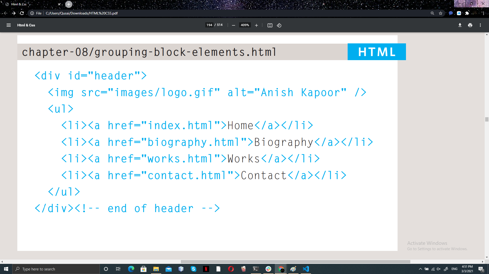
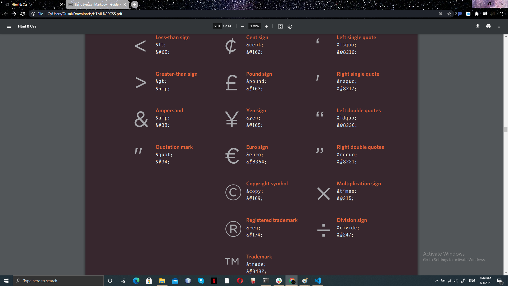
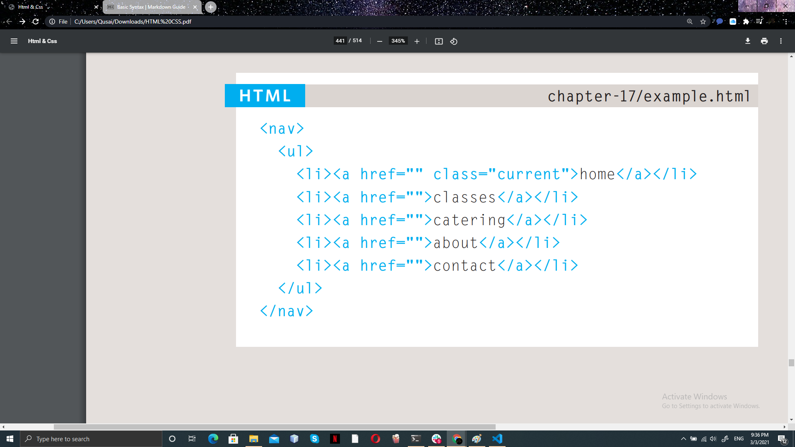

### HTML 4 was released in 1997 
### XHTML 1.0 was released in 2000 
> There was also a third version
of XHTML 1.0 called XHTML
1.0 Frameset
#### HTML 5 was released in 2000

# DOCTYPES :
> Because there have been
several versions of HTML, each
web page should begin with a
DOCTYPE declaration to tell a
browser which version of HTML
the page is using

#### HTML 5

<!DOCTYPE html>
<!DOCTYPE html PUBLIC
"-//W3C//DTD

#### HTML 4

<!DOCTYPE html PUBLIC
"-//W3C//DTD HTML 4.01 Transitional//EN"
"http://www.w3.org/TR/html4/loose.dtd">

#### Transitional XHTML 1.0

<!DOCTYPE html PUBLIC
"-//W3C//DTD XHTML 1.0 Transitional//EN"
"http://www.w3.org/TR/xhtml1/DTD/
 xhtml1-transitional.dtd">
 
 #### Strict XHTML 1.0
 
 <!DOCTYPE html PUBLIC
"-//W3C//DTD XHTML 1.0 Strict//EN"
"http://www.w3.org/TR/xhtml1/DTD/
 xhtml1-strict.dtd">
 
 #### XML Declaration

<?xml version="1.0" ?>

# Comments in HTML

 < !-- -->

#### example 

# ID attribute 

Every HTML element can carry
the id attribute. It is used to
uniquely identify that element
from other elements on the
page 

#### example

# Class Attribute

Every HTML element can
also carry a class attribute.
Sometimes, rather than uniquely
identifying one element within
a document

#### example 

# Block Elements

Some elements will always
appear to start on a new line in
the browser window. These are
known as block level elements.

# Inline Elements

Some elements will always
appear to continue on the
same line as their neighbouring
elements. These are known as
inline elements

# Grouping Text & Elements In a Block

 > < div>

The < div > element allows you to
group a set of elements together
in one block-level box 

#### example 

> < span>

The < span> element acts like
an inline equivalent of the < div>
element. It is used to either:

- Contain a section of text
where there is no other suitable
element to differentiate it from
its surrounding text
- Contain a number of inline
elements

# Iframes

>An iframe is like a little window
that has been cut into your
page 

#### Iframe attributes

>- src : The src attribute specifies the
URL of the page to show in the
frame.
>
>- height : The height attribute specifies
the height of the iframe in pixels.
>
>- width : The width attribute specifies
the width of the iframe in pixels.

# Iformation about your page 

> < meta> The < meta> element lives inside the < head>.
element and contains.
information about that
web page.

# Escape Characters

> Examples
>
> 

>&lt;**div**&gt; 
it's very usfel to group 
together related elements on the page .
>> auther Authors used class or id attributes
to indicate the role of the &lt;**div**&gt;

># HTML5 
>introduces a new set of elements that allow you to divide up the
parts of a page.
>- &lt;**header**&gt; And &lt;**footer**&gt;
>
>  used for :
>>- The main header or footer
that appears  at the top or
bottom of every page on the
site
>>- A header or footer for an
individual &lt;article&gt; or
&lt;section&gt; within the page.

>&lt;**nav**&gt;
> The &lt;nav&gt; element is used to
contain the major navigational 
blocks on the site such as the
primary site navigation.
>
> example :

> 

